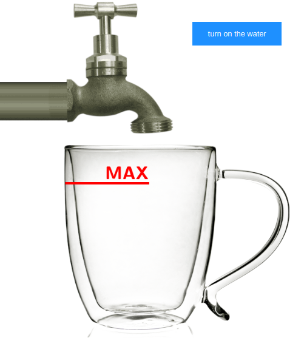
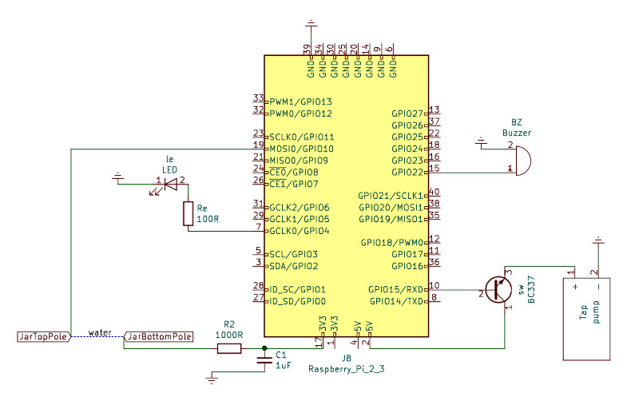

Fill the jar
============

This project is a proof of concept in a dojo-like format to practice a test
driven approach. The final result is an interactive web interface connected to a remote API,
and this API handles real electronic components and a sensor.

A trip from the TDD/BDD to the IoT only with Javascript.

It takes advantage of [browserify](http://browserify.org/) to convert the nodejs modules into a browser 
supported controllers. 
 
It uses [express](https://expressjs.com/) for the HTTP API endpoints.

It handles the Raspberry Pi GPIO with the lightweight library
[rpi-gpio](https://github.com/JamesBarwell/rpi-gpio.js).

See the final result video.

[](http://www.youtube.com/watch?v=qSrHnOv2n00 "Video result")

## Important warnings ##

Do not connect the Raspberry Pi pins if you do not know your specific device 
model pin out.

Do not put animals in the water because with the "cable pelao" sensor, a small
current goes through the water.

## Dojo format ##

This repository is a consecutive git commits based on a step-by-step dojo to
practice test driven development.

This project has been created for a special [Leadtech's middleend team](https://leadtech.com) 
presentation. Fabulous team in a great company!

### Dojo directives ###

There is a webpage interface with a tap, a button and a jar with a maximum level
mark. The practice consists on to give two features to the interface:

* Turn on the water when I click the button.
* Turn off the water when the level reaches the maximum mark.



The point in this exercise is to program a decoupled logic to be used in
different implementation.

Development steps as follows.

#### Core logic ####

* Create the core logic from a test driven approach.
* Encapsulate the logic into reusable use cases able to be implemented in 
  multiple contexts.

#### Frontend integration ####

First implementation, we need visual, we want to see the water falling, and 
finally the jar filled up.

Source code in [src/web/index.html](src/web/index.html).

* Turn on: Show the water falling when user clicks on the button.
* Turn off: Wait for a few seconds and display the jar filled up to the MAX mark.

Usage: open the html file in your browser and use it as is.

##### Browserify the modules #####

After creating the [src/web/js/fillthejar-local.js](src/web/js/fillthejar-local.js) file in 
the nodejs way you have to browserify it. I fastly got done by adding the 
variables into the global window object and bundling it with browserify package.

Run the following command every time you edit an involved file.

```
browserify src/web/js/fillthejar-local.js -o src/web/js/fillthejar-browser-local.js
browserify src/web/js/fillthejar-ngrok.js -o src/web/js/fillthejar-browser-ngrok.js
```

#### Backend integration ####

Publish the interface to the world, so you can access it remotely. All clients 
remotely share the water state, if it is turned on, off, or the jar reached the 
maximum level.

##### Express API #####

Start the backend server as follows.

```
node src/api/app.js
```

##### From ngrok to the world #####

You can use ngrok to populate the service outside your local network.

The free use of ngrok allows only 20 requests for minute. The default index.html 
file is for ngrok at 5 second intervals, and the index-local.html is for local
use only.

#### "Realend" integration ####

Things that happen in the reality, and special thanks to [rpi-gpio](https://github.com/JamesBarwell/rpi-gpio.js)
the digital input and outputs that I need for this exercise can be handled with 
Javascript.

##### Raspberry Pi pin out #####

Do not connect GPIO interface wires if you do not know every pin. You can damage
your Raspberry Pi device. To absolutely know the pin out of your device, execute
the `pinout` command. I made this project on a Raspberry Pi 3 B+ and the pin out
is as follows, not all models have the same pin out:

```
$ pinout
,--------------------------------.
| oooooooooooooooooooo J8     +====
| 1ooooooooooooooooooo  PoE   | USB
|  Wi                    oo   +====
|  Fi  Pi Model 3B+ V1.3 oo      |
|        ,----.               +====
| |D|    |SoC |               | USB
| |S|    |    |               +====
| |I|    `----'                  |
|                   |C|     +======
|                   |S|     |   Net
| pwr        |HDMI| |I||A|  +======
`-| |--------|    |----|V|-------'

Revision           : a020d3
SoC                : BCM2837
RAM                : 1024Mb
Storage            : MicroSD
USB ports          : 4 (excluding power)
Ethernet ports     : 1
Wi-fi              : True
Bluetooth          : True
Camera ports (CSI) : 1
Display ports (DSI): 1

J8:
   3V3  (1) (2)  5V    
 GPIO2  (3) (4)  5V    
 GPIO3  (5) (6)  GND   
 GPIO4  (7) (8)  GPIO14
   GND  (9) (10) GPIO15
GPIO17 (11) (12) GPIO18
GPIO27 (13) (14) GND   
GPIO22 (15) (16) GPIO23
   3V3 (17) (18) GPIO24
GPIO10 (19) (20) GND   
 GPIO9 (21) (22) GPIO25
GPIO11 (23) (24) GPIO8 
   GND (25) (26) GPIO7 
 GPIO0 (27) (28) GPIO1 
 GPIO5 (29) (30) GND   
 GPIO6 (31) (32) GPIO12
GPIO13 (33) (34) GND   
GPIO19 (35) (36) GPIO16
GPIO26 (37) (38) GPIO20
   GND (39) (40) GPIO21

For further information, please refer to https://pinout.xyz/
```

Supported models:

* Raspberry Pi 1 Model A
* Raspberry Pi 1 Model A+
* Raspberry Pi 1 Model B
* Raspberry Pi 1 Model B+
* Raspberry Pi 2 Model B
* Raspberry Pi 3 Model B
* Raspberry Pi 3 Model B+
* Raspberry Pi 4 Model B
* Raspberry Pi Zero
* Raspberry Pi Zero W

##### Circuit #####

Components:

* Raspberry Pi (supported model).
* 5V water pump.
* 1-2K resistor for water switching sensor.
* Buzzer for sounding the state.
* 100R resistor and led for lighting the state.
* Underwater pole and maximum level mark pole wires for sensor.
* NPN Transistor as a switch to let the 5V RPi output feeding the pump.
* Pipe, water recipients, and all required for a handmade "tap" pumping to "jar".

The following circuit schema is based on the Raspberry Pi 3 B+ pin out, and it
matches with the configuration file [src/config.js](src/config.js).



## Installing and usage in a Raspberry Pi ##

After you made and connected everything in the circuit, follow the next steps. 

Configure the web server port and GPIO pins in [src/config.js](src/config.js).

Install dependencies and separately the rpi-gpio that only works in Raspberry Pi 
environment.

```
npm install
npm install rpi-gpio
```

Execute the unit tests.

```
npm test
```

Start the webserver.
```
node src/api/app.js
```

Visit the local webpage at [http://localhost:3000/web/index-local.html](http://localhost:3000/web/index-local.html)
and click the button. 

You will see something like it is shown in the [video](https://youtu.be/qSrHnOv2n00).

## Hardware simple test ##

Here [test/poc](test/poc) there is a proof of concept script, and a circuit 
picture. It consists in turning on and off a led and the pump in a 
Raspberry Pi 3 B+. It is useful to check your device model support.

## Author ##

Jaume Mila <jaume@westial.com>
